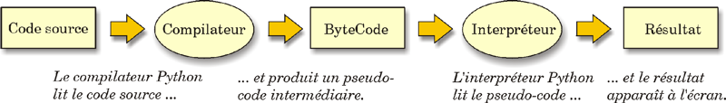

# Introduction à Python 

## Interprété vs compilé? 

Python est un langage fonctionnant en 2 étapes grâce à un interpréteur: 

* Tout d'abord, on a une lecture du fichier `.py` par l'interpréteur pour fournir un fichier binaire `.pyc` se trouvant dans un fichier `__pychache__`;

* Ensuite, on a l'interprétation du fichier binaire en langage bas niveau et c'est là que la console python peut détecter les potentielles erreurs dans votre script. 



Voilà la raison pour laquelle vous avez du installer un interpréteur. Malgré tout, il faut savoir qu'un nouveau framework ([PyScript](https://pyscript.net/)) présenter lors de la PyCon de juin 2022 aurait son propre interpréteur vous libérant de cette contrainte d'installer un interpréteur sur vos différentes machines. 

## La syntaxe de Python 

Un des points central de Python est son système d'indentation. En effet, dans ce langage, l'indentation est primordiale car elle permet de faire comprendre à l'interpréteur les différents blocs de code ainsi que la dépendance de ces blocs.

Un autre élément est l'utilisation du `:` remplaçant le système de `{}` présent dans les autres langages de programmation. 

## Quelques principes de base pour utiliser Django 

La majorité des éléments de code de Python sont très similaires à ce que vous avez vu en JavaScript ou PHP. Bien évidemment, il y a les spécificités propres à la syntaxe comme le `:` ou l'indentation. Mais une liste reste une liste, une fonction reste une fonction, etc...

### Les objets de stockage

Il existe 4 types d'objet de stockage en python : 

* Les listes : ce sont des collections d'éléments ordonnés, modifiables et pouvant contenir plusieurs fois la même valeur ;

* Les tuples : ce sont des collections d'éléments ordonnés, immuables et pouvant contenir plusieurs fois la même valeur ;

* Les dictionnaires : ce sont des collections d'éléments non ordonnés indexés, modifiables et fonctionnant avec un système de clé:valeur. C'est l'équivalent des arrays associatifs en PHP) ;

* Les set : ce sont des collections d'éléments non ordonnés et non indexés, ne pouvant contenir deux fois la même valeur

Voici des  exemples d'objets de stockage :

````python
liste = ["Steph", False, 42]

tuple1 = ("Steph", False, 42)
tuple2 = ("Steph", False, 42, ("Steph", True, 19))

dict = {"nom": "Steph", "age": 19, "sport": False}
````

### Les boucles conditionnelles

La philosophie des boucles reste similaire à ce que l'on connait déjà. Il y a néanmoins quelques petites différentes propre à la syntaxe Python. 

#### Les boucles if

````python
if(condition1):
    print("sortie")
elif(condition2):
    print("sortie")
else:
    print("sortie")
````

#### Les boucles for

````python
list = [1,2,3]
for(elem in list):
    print(elem)
````

#### Les boucles while

````python
x=0
while(x>5):
    x+=1
    print(x)
````

### Les fonctions

Pour écrire une  fonction en Python, il suffit de mettre le mot-clé `def` devant la fonction pour faire comprendre à l'interpréteur de notre bloc de code correspond à une fonction. 

 ````python
def addition(x, y):
    print("L'addition vaut ", x + y)

addition(4,5)
# L'addition vaut 9
````

### Les classes

Pour écrire une classe, vous devez utiliser le mot-clé `class`. Le principe des classes reste similaire à ce que l'on a vu en PHP à quelques différences : 

- le mot clé `this` est remplacé par `self`
- le constructeur est construit via `__init__(self, ...)`

L'héritage d'une classe également un peu différente. Lors de la création d'une classe héritant d'une autre classe, vous allez simplement écrire `class nouvelle_classe(classe_héritéé):`

````python
class Utilisateur():
    def __init__(self, prenom, age):
        self.prenom = prenom
        self.age = age
        
    def getName(self):
        print("Je suis ", self.prenom)


class Presentation(Utilisateur):
    def getPresentation(self):
        print("Je suis ", self.prenom, "et j'ai", self.age, "ans")

moi2 = Presentation('Bernard', 29)
moi2.getPresentation()
# Je suis Bernard et j'ai 29 ans
````

### Les modules 

Un module est un fichier python qui est importé dans d'autre script python. Imaginons, dans le module `matplotlib` vous voulez avoir accès aux outils pour créer des graphiques, vous aller importer le module `pyplot` depuis `matplotlib`

````python
from matplotlib import pyplot
````

L'importation de module est une pratique au cœur des projets python et encore plus dans l'architecture d'un projet Django. 

[Quelques petits exercices? Ok, si vous insistez!](https://github.com/CalcagnoLoic/workshop_python/blob/main/1.Introduction_python/intro_python_correctif.ipynb)
