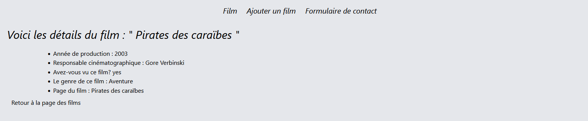
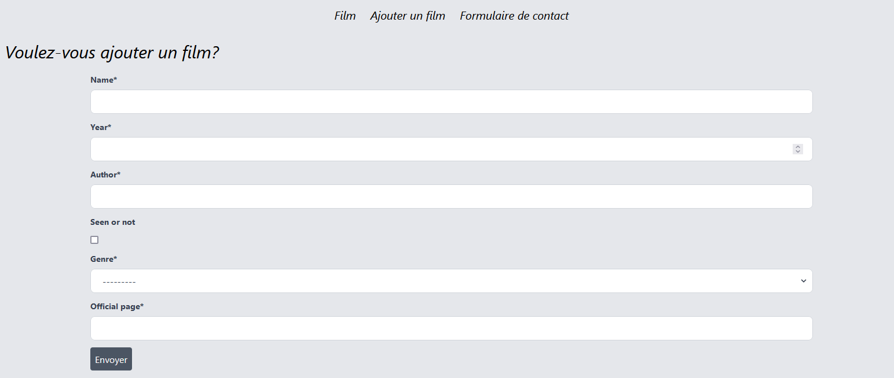

# Introduction au framework Django

Django est un framework Python que l'on qualifie de framework fullstack. C'est un framework permettant de développés des sites internet assez facilement. 

Django est gratuit et open source. Il possède une très bonne [documentation](https://docs.djangoproject.com/en/4.0/).

Les caractéristiques d'une application écrite avec Django sont les suivantes :

- Django offre un certain niveau de polyvalence. En effet, vous pouvez tant créer une simple application, un site web d'actualités ou même un réseau social. 

- Django vous offre un cadre de développement. Lorsque l'on starte un projet, tout le cadre dont le développeur a besoin sont présents. Il fournit également une certaine sécurité à votre site car les mots de passe sont envoyés dans une fonction de hachage cryptographique. De plus, par défaut, les injections SQL, le CSS, CSRF sont des protections implémentées par Django. 

- Vos applications sont portable. En effet, le Python est un langage fonctionnant sous diverses plateformes. Cela indique que lorsque vous développer en Django, vous n'avez pas de contrainte de plateforme. 

## Popularité de Django

Django est un framework assez populaire dans la communauté Python. Beaucoup de sites que vous connaissez probablement ont été écrit via ce framework. C'est le cas par exemple de Instagram, Mozilla, National Geographic, Pinterest ou bien encore Open Stack. 

## Restrictif ou non?

Vous devez maintenant savoir que des frameworks peuvent être soit restrictif ou non. 

Dans le cas de Django, on se retrouve dans un cas entre les deux. Même s'il tend à être plus ou moins restrictif. Il offre donc le meilleur de l'approche restrictive et non restrictive d'un framework. 

## L'architecture d'un projet Django

Comme dit plus haut, un projet Django est considéré comme fullstack. En effet, vous aurez autant une partie backend avec du python. Et une partie frontend avec des éléments statiques permettant de gérer le côté CSS et JavaScript de votre application. 

Django fonctionne sous le principe du MVT (ce principe sera expliqué plus loin) qui est assez similaire à la structure de pensée du MVC de PHP/Laravel. 

## Les autres caractéristiques de Django

Dans ce workshop, nous allons surtout nous concentrer sur la caractéristique au cœur du framework : le MVT. 

Mais vous devez savoir qu'il y a bien d'autres possibilités offertes par Django :

- La gestion de formulaire. Le processus de création, de validation et de traitement d'information est simplifié par Django. Vous pouvez avoir un aperçu de cela dans le bonus n°1. 

- L'authentification et la permission des utilisateurs. Avec le système de décorateurs Python, Django ajoute une couche de sécurité et de gestion de permission à votre application. 

- L'administration Django. Il s'agit de la partie administration de votre site qui est incluse par défaut dans les projets. Cette partie admin permet aux dev de CREATE, UPDATE et DELETE très facilement des infos de la base de données. Et en éditant un fichier du framework, vous pouvez également voir n'importe quel modèle présent dans le site. 

- Django permet également une simplification de la sérialisation des données en format JSON.

Voici en assez général quelques informations concernant ce framework. Je vous propose dès à présent de construire notre projet. 

## L'objectif de ce workshop

La finalité est bien évidemment de pouvoir faire un petit site avec Django mais surtout de bien appréhender tant le MVT, que les concepts propre à Django. 

Les objectifs à atteindre sont donc d'avoir une liste des films présents dans la base de données ainsi que visualiser les détails. 

L'autre objectif est d'implémenter des formulaires :

- Que ce soit pour ajouter des données dans la base de données

- Que ce soit pour envoyer un mail de contact

[Installons un environnement virtuel et startons notre projet](https://github.com/CalcagnoLoic/workshop_python/blob/main/2.Framework_django/01.start_venv.md)
