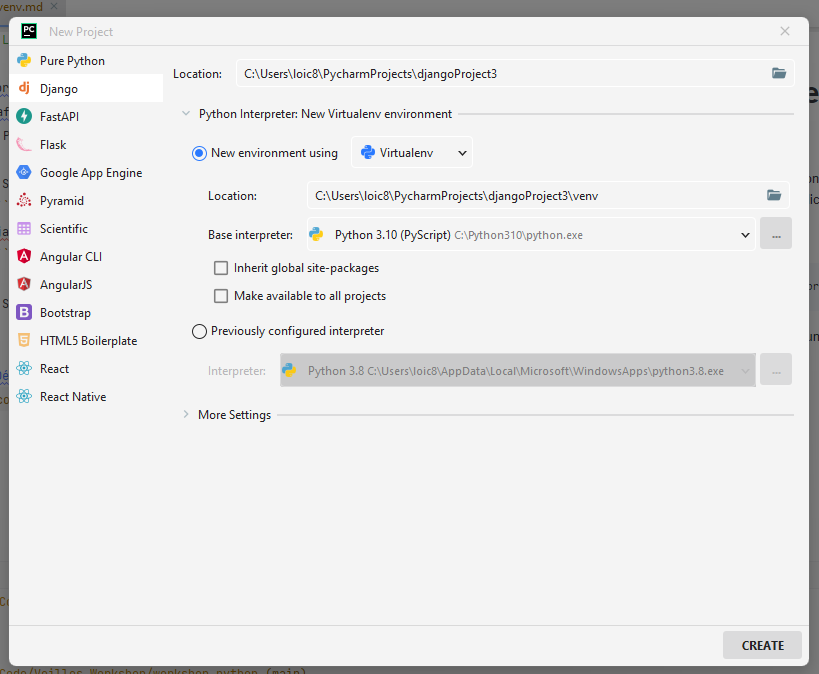
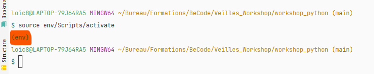

# Les environnements virtuels et starter un projet django

## Start de l'application

Lors de la création d'un projet django, on commence par starter le projet afin d'avoir les fichiers de base servant au bon maintient de l'application. Pour cela, il y a deux façons de faire :

* Soit on utilise le terminal
````python
django-admin startproject <nom_du_projet>
````

* Soit on utilise l'option pour starter un projet django dans PyCharm



L'avantage lorsque l'on procède avec la deuxième façon est que l'on crée, en même temps que notre projet, un environnement virtuel. Nous reviendrons dans quelques instants sur ces environnements virtuels. Mais avant tout, regardons les fichiers que nous avons à notre disposition actuellement. 

L'arborescence du projet est la suivante :

````
_____
  |
  |------django-app
  |          |
  |          |--urls.py
  |          |--settings.py
  |          |--asgi.py
  |          |--wsgi.py
  |
  |------manage.py
````

3 fichiers seront à la base du développement de notre application : 

* manage.py : c'est ce fichier qui est à la base de votre projet, surtout **n'y touchez pas**. Il va vous permettre d'effectuer des schémas de migration, des migrations, d'ouvrir le serveur etc. D'ailleurs, testez cette commande dès à présent dans le terminal! Si tout se passe bien, vous devriez voir apparaitre votre application! 

````python
python manage.py runserver
````

* settings.py : il s'agit du fichier de configuration de django. C'est ici que vous allez ajouter les paths vers les dossiers contenant les différents fichiers statics (js, img, fonts, ...), les différents medias, les différentes apps, etc...

* urls.py : il s'agit de notre routeur. C'est dans ce fichier que l'on va ajouter les urls ainsi que la liaison vers les différentes views.

## Les environnements virtuels

Un environnement virtuel est un environnement Python isolé au sein d'un projet bien défini. Il va contenir tous les packages nécessaire au bon fonctionnement du projet. Cela signifie que vous pouvez avoir des environnements dans vos projets qui sont différents d'un projet à l'autre et surtout différent du système. Vous pourriez par exemple travailler avec une version de Python différentes d'un projet à l'autre. 

Pour installer un environnement virtuel, il suffit de l'installer via le pip :

````python
python -m venv env
````

Si une erreur se produit, c'est certainement le fait que le package virtualvenv n'est pas installé sur votre machine.

Une fois la création de environnement virtuel réalisé, il suffit de l'activer.

````python
source env/Scripts/activate
````

Et là, dans votre terminal, l'environnement virtuel apparait! 



Finalement, installons django dans notre projet! Pour cela, il suffit de réaliser cette commande :

````python
pip install django
````

Toutes mes félicitations, vous avez installé django dans votre projet! :) 

Dernière étape, on va "freeze" les packages installés dans notre environnement virtuel :

````python
pip freeze > requirements.txt
````

## Installation de l'application

On va dès à présent installer une application django. Une application django peut être vue comme un module possédant des sous-modules avec différents fichiers pour les modèles, les templates, les vues, les formulaires, etc... 

````python
python manage.py startapp <nom_app>
````

Une fois que c'est fait, le premier réflexe est d'aller ajouter cette application dans le fichier `settings.py`

````python
INSTALLED_APPS = [
    'django.contrib.admin',
    'django.contrib.auth',
    'django.contrib.contenttypes',
    'django.contrib.sessions',
    'django.contrib.messages',
    'django.contrib.staticfiles',
    'nom de l\'application',
]
````

L'arborescence de notre projet devient : 

````
_____
  |------app
  |       |--migrations
  |       |--admin.py
  |       |--apps.py
  |       |--models.py
  |       |--test.py
  |       |--views.py
  |
  |------django-app
  |          |
  |          |--urls.py
  |          |--settings.py
  |          |--asgi.py
  |          |--wsgi.py
  |
  |------manage.py
````

Voyons à quoi servent les différents fichiers/dossiers. 

* Le dossier migrations contiendra tout nos schéma de migration de la base de donnée

* admin.py : il s'agit du fichier nous permettant de personnaliser notre espace administrateur du projet

* models.py : il s'agit du fichier om nous allons créer nos modèles pour la base de données. C'est le fichier à la base de nos migrations.

* views.py : il s'agit du fichier contenant les vues de notre application. **ATTENTION** il ne s'agit des des mêmes vues quand dans le MVC! Les views dans django sont les fonctions/classes appelées dans le routeur et qui permettent de se connecter aux modèles ainsi qu'aux templates. 

# A vous de jouer! 

- [ ] Créez votre environnement virtuel et activez-le
- [ ] Installez django et freezer les dépendances dans un fichier requirements.txt
- [ ] Installez votre application django en mettant à jour les paramètres du projet

[Découverte du MVT](https://github.com/CalcagnoLoic/workshop_python/blob/main/2.Framework_django/02.mvt.md)