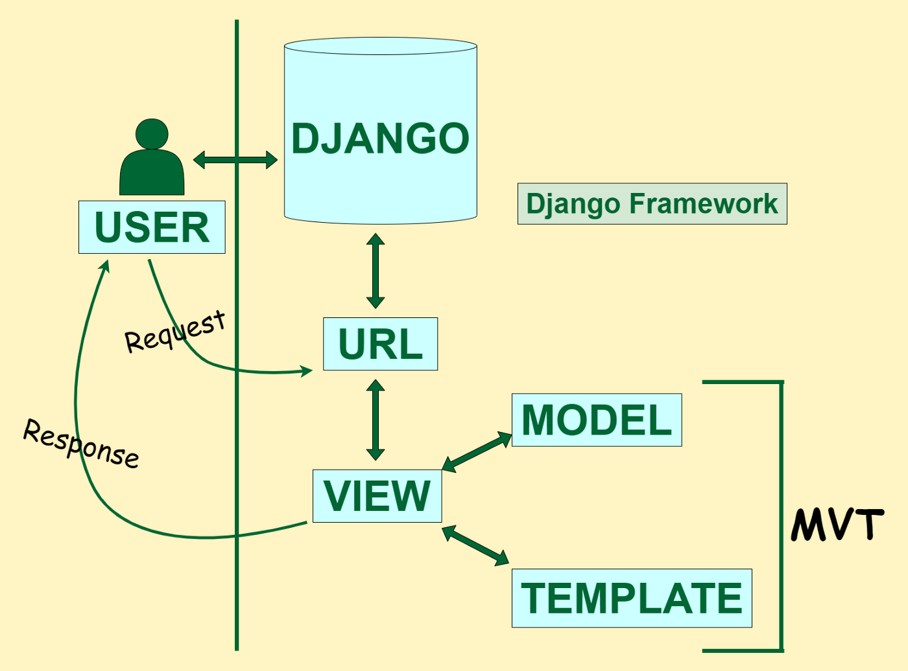

# Le MVT (Models-Views-Template)

Django est un framework basé sur le principe du MVT. 

Vous pouvez voir sur l'illustration, que le framework fonctionne grâce à 4 composants : URL, VIEW, MODEL et TEMPLATE. 

Voyons ce que signifie chaque composant. 

# URL

Dans le fichier `url.py` du `startproject`, on retrouve un router. Ce routeur est utilisé pour rediriger les requêtes HTTP à la vue appropriée d'après l'URL de la requête. 

L'URL peut également contenir des patterns qui seront utilisés dans ce que l'on appelle des gabarits d'URL lors de la création de navbar par exemple. 

On pourrait également retrouver des nombres dans le cas de visualisation de templates spécialisés dépendant d'un ID bien précis. 

# VIEW

Une vue est une fonction gérant les requêtes. La vue va recevoir la requête HTTP et renvoie une réponse HTTP via une fonction `render`.

Les vues sont au centre du MVT en accédant aux données du modèles et en les stockant dans un contexte.

# MODELES

Les modèles sont tout simplement des classes Python définissant la structure des données d'une application en enregistrant dans une base de données. 

Il faut savoir que Django est un ORM et donc, vous n'avez pas de requête SQL à écrire. Django vous permet de travailler uniquement sur vos classes Python, et donc sur vos objet. Il s'occupe de traduire vos modèles en requêtes SQL. 

Quand vous créez des modèles, il faut par la suite appliquer des migrations. C'est la manière par laquelle Django propage des modifications apportées aux modèles dans un schéma de base de données. 

# TEMPLATE

C'est tout simplement le fichier permettant la mise en page de votre site. Les templates sont contextualisés grâce aux contextes présents dans le `render` des views. 

# Résumé

Si on résume le MVT, l'URL dirige vers une vue spécifique à cette URL. 

La vue va récupérer les données contenues dans le modèle pour les stocker dans un contexte. 

Finalement, la vue renvoie vers un fichier structuré qui est peuplé avec les données du modèle transitant par le contexte.

Maintenant que vous connaissez le MVT, on va construire ensemble chaque composant du MVT.

[Créons un modèle](https://github.com/CalcagnoLoic/workshop_python/blob/main/2.Framework_django/03.models.md)