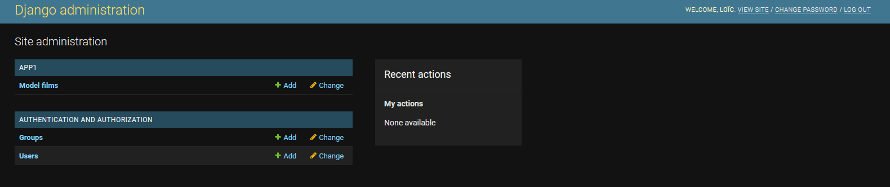
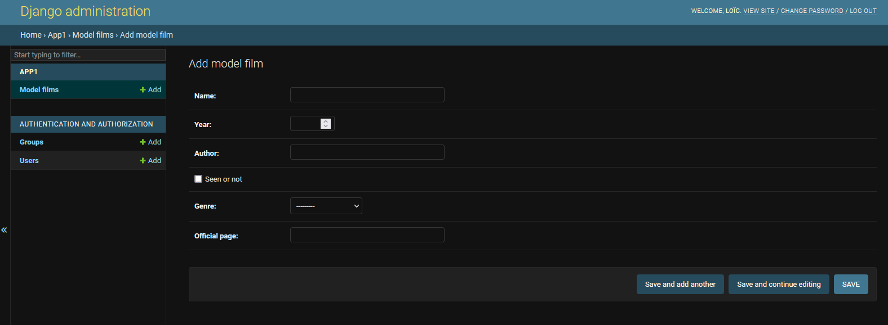
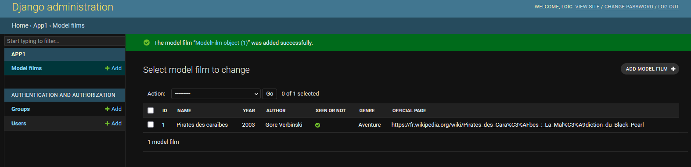

# L'admininistration Django et la création d'un superuser

Pour atteindre la partie admin de django, rendez-vous à cette adresse: 127.0.0.1:8000/admin 


Et oui! il faut un mot de passe! On va s'en occuper tout de suite! 

## Création d'un superuser

On va créer notre accès à la partie admin de notre projet. Pour cela, dans le terminale, on va créer un superuser.

````python
python manage.py createsuperuser
````

Et là, vous aurez à entre votre username, une adresse mail (facultatif) ainsi qu'un mot de passe. 

Revenons sur notre page internet. Rentrons notre username et le mot de passe et bienvenue dans votre espace administrateur! 


## Ajout de nos tables dans l'admin

Pour avoir accès à nos tables, il faudra aller faire des modifs dans le fichier `admin.py`.

La première chose à faire, est d'importer les classes présentes dans le fichier `models.py`. 

Une fois que cela sera fait, il nous suffit de créer une sous-classe de `django.contrib.admin.ModelAdmin` possédant une propriété qui se nomme `list_display`. Cette propriété sert à lister les noms des fields que modèles créés que l'on veut apercevoir dans notre admin.

Enfin, il suffira d'enregistrer notre sous-classe et notre modèle dans l'admin pour y avoir accès depuis notre page web. 

````python
from django.contrib import admin

from app1.models import ModelFilm


class AdminFilm(admin.ModelAdmin):
    list_display = ("id", "name", "year", "author", "seen_or_not", "genre", "official_page")


admin.site.register(ModelFilm, AdminFilm)
````




Après avoir rempli le formulaire, on a un objet dans notre table! 



Nous avons réalisé une partie du CRUD, à savoir CREATE. 

Nous pouvons également faire le DELETE en cochant l'objet à supprimer. 

Pour l'UPDATE, là il vous faudra spécifier le champs "id" dans la propriété `list_display` de votre sous-classe. 

# A vous de jouer! 

- [ ] Ajoutez votre modèle dans l'admin
- [ ] Ajoutez quelques objets dans votre table

[Créons une views](https://github.com/CalcagnoLoic/workshop_python/blob/main/2.Framework_django/05.views.md)
