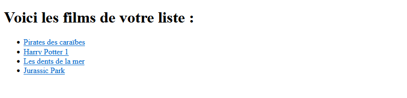

# Les templates et la syntaxe Django

Un template django c'est tout simplement un fichier `html` contenant les balises sémantiques que l'on connait accompagné d'une syntaxe propre à django. 

## La syntaxe Django

Pour le moment, notre vue appelle le modèle et fournit au template les informations de la base de données via le contexte. Nous devons afficher ces éléments via cette syntaxe propre à django. 

Reprenons notre modèle comprenant nos différents fields. Imaginons, on veut afficher la variable correspondant à un field, il suffit de parcourir notre contexte avec une boucle for et venir extraire le field en question. 

````python


{{elem.name}} # Ceci est une variable Django
{{elem.email|yesno}} # Ceci est un filtre Django permettant de transformer les booléens True/False en Yes/No
    

````

On pourrait résumer comme ceci :

* Lorsque que l'on veut afficher du contenu du type "variable", on utilisera `{{ var }}`
* Lorsque l'on veut créer des liens statics, des urls (de navbar, hrefs, ...) ou des boucles, on utilisera des balises ``

Avant d'écrire nos templates, il est nécessaire de voir comment "extend" un template. En effet, si on a 15 templates dans notre application, on ne va pas réécrire 15 fois les meta tag, links, scripts etc. (**DRY ;)** )

# Extend un template

Ce qui nous intéresse, c'est de venir écrire une syntaxe django dans un template de base qui ne bougera pas durant tout le développement. Le but, c'est que c'est syntaxe django corresponde au bloc de contenu spécifique à **chaque** template. 

Tout ça pour dire, que dorénavant, dans nos templates, il suffira d'écrire le contenu du bloc. 

Voyons tout de suite comment spécifier cela: 

````html
<!DOCTYPE html>
<html lang="fr">
<head>
    <meta charset="UTF-8">
    <meta http-equiv="X-UA-Compatible" content="IE=edge">
    <meta name="viewport" content="width=device-width, initial-scale=1.0">
    <title>Application django</title>
</head>
<body>
    <header> 
        <!--Navbar par exemple-->
    </header>

    <main>
        <!--Contenu spécifique aux templates-->
        

        
    </main>

    <footer>
        <!--Footer -->
    </footer>
</body>
</html>
````

Le `block content` correspond à ce contenu spécifique qui changera à chaque template. Ce fichier `html` est donc la base de tout nos templates. Une fois qu'il est écrit, il suffira de venir ajouter un gabarit django permettant d''extend' ce fichier de base. 
Et dans ce template, il ne vous restera qu'à écrire le contenu spécifique du `block content`. 

## A vous de jouer 

- [ ] Créez un fichier `base.html` servant de base aux différents templates. 

# Ecriture d'un template

On commence tout d'abord par importer notre fichier de base créer auparavant et d'ajouter nos variables Django. 

````html



<h1>Voici les films de votre liste :</h1>

<ul>
    
    <li>
        {{elem.name}}
    </li>
    
</ul>


````

## A vous de jouer 

- [ ] Créez un fichier `homepage.html` affichant une liste à puce avec un seul élément de votre base de données.

# Ecriture d'un template spécialisé

Vous voici devenu des pros du MVT dans Django. On va complexifier un peu nos templates. En effet, pour l'instant, on ne voit qu'une seule information. 

Maintenant, ce que j'aimerai, c'est que lorsque je clique sur le nom d'une personne, c'est que je sois redirigé vers un template spécialisé possédant les informations de la personne. 

Pour faire cela, il faut pouvoir extraire l'ID de l'objet sur lequel on clique pour voir être redirigé vers le template spécialisé de l'ID en question. 

Pour faire cela, on doit un peu complefixier notre path pour lui faire comprendre que l'ID est important. On doit également modifier un élément dans notre vue et.... c'est tout! Après ça reste un template à écrire de façon classique! 


## Extraction de l'ID dans le path et la vue

Ajoutons une nouvelle url liée à l'ID

````python
from django.contrib import admin
from django.urls import path

from app1 import views

urlpatterns = [
    path('admin/', admin.site.urls),
    path("", views.homepage, name="homepage"),
    path("movie_details/<int:id>/", views.movie_details, name="movie_details") # Path lié à l'id
]
````

On ajoute une nouvelle vue

````python
def movie_details(request, id):
    movie = ModelFilm.objects.get(id=id)
    return render(request, 'app1/movie_details.html',
                  {'movie': movie})
````

Et voilà, la partie la plus compliquée des templates spécialisées est passée! ;)

## Ajout des gabarits urls et écriture du template

Avant d'écrire notre template spécialisé, il faut que nos éléments de notre template soient connecté vers l'urls du templates spécialisés. On va dès lors utiliser des garabits d'urls. 

Vous vous souvenez les attributs `name` que l'on a ajouté dans les path du router? C'est ici qu'on va les utiliser. On va mettre ces attributs dans le gabarits url comme ceci : ``

Si on modifie notre template ci-dessus en ajoutant le gabarit d'url :

````html



<h1>Voici les informations contenues dans la base de données</h1>

<ul>
    <li>
        
         <a href="">{{elem.name}}</a>
        
    </li>
</ul>


````


Et voici, nos éléments du templates soit bien des liens cliquables désormais. 

Maintenant, il ne reste plus qu'à écrire notre template spécialisé. 

````html



<h1>Voici les détails du film : " {{movie.name}} " </h1>

<ul>
    <li>Année de production : {{ movie.year }}</li>
    <li>Responsable cinématographique : {{ movie.author }}</li>
    <li>Avez-vous vu ce film? {{ movie.seen_or_not|yesno }}</li>
    <li>Le genre de ce film : {{ movie.get_genre_display }}</li>
    <li>Page du film : {{ movie.official_page }}</li>
</ul>

<a href="">Retour à la page des films</a>


````
Vous pouvez noter que j'ai utilisé `get_genre_display` dans la dernière variable. Rappelez-vous, le field `genre` du modèle est une liste déroulante de choix. Il suffit d'ajouter `.get_FIELD_display` dans votre variable Django pour afficher la valeur de la liste déroule au lieu du code (Horreur au lieu H). 


Finalement, pour activer les liens des pages officielles, il ne vous reste qu'à ajouter des balises a ayant `{{ movie.official_page }}` en valeur de l'argument `href`.

````html
<li>Page du film : <a href="{{ movie.official_page }}" target="_blank">{{ movie.name }}</a></li>
````

## A vous de jouer 

- [ ] Ajouter des gabarits url à `homepage.html`
- [ ] Ajoutez un path et une vue permettant de récupérer l'id d'un objet de la base de données
- [ ] Créez un fichier `details.html` contenant les informations de la base de données en lien avec l'objet sur lequel vous avez cliqué

Félicitations, vous êtes arrivés au bout de l'introduction du MVT de Django! 


# Et maintenant ? 

Les fonctionnalités et possibilités de ce framework sont loin d'être finies. Si vous voulez en apprendre plus, n'hésitez pas à continuer vers la partie bonus. 

Si vous avez des questions, bien évidemment, contactez-nous ;)

[En route pour les formulaires et le style](https://github.com/CalcagnoLoic/workshop_python/blob/main/2.Framework_django/B0.bonus.md)


