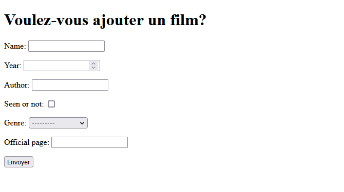
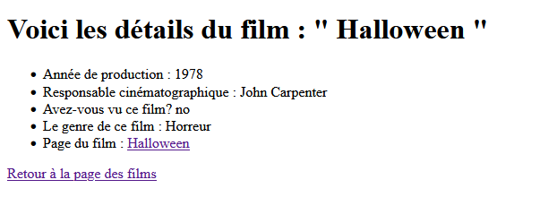
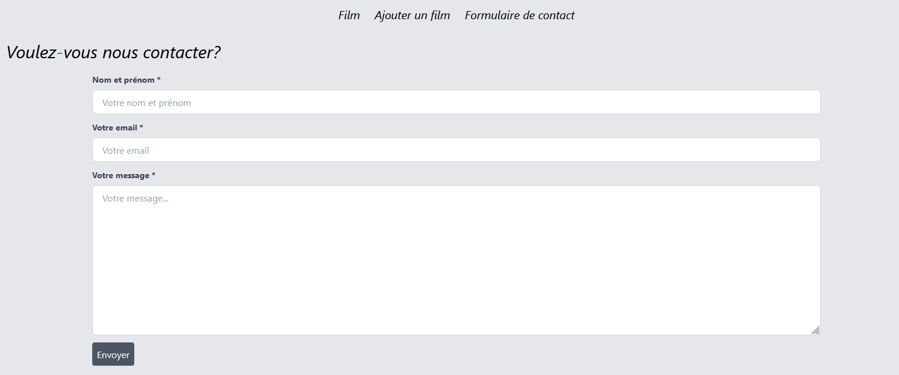
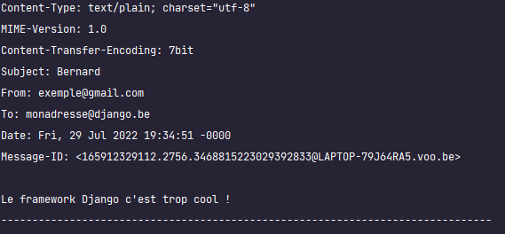

# Les formulaires Django

La création des formulaires dans Django est relativement simple. 

Ici, nous allons créer deux types de formulaire. Un formulaire permettant d'ajouter un film à la base de données et un formulaire de contact. 

# Ajout d'un film dans la base de données

Commençons par créer un nouveau fichier que l'on nomme `forms.py` où nous retrouverons les différents formulaires présent sur notre application. 

Le but est de créer un formulaire ayant récupérant les différents fields du modèle contenu dans la base de données. On va créer une classe héritant des formulaires propre au modèle en lui associant une classe Meta. Cette dernière nous permettra d'associé le modèle adéquat ainsi spécifier les champs que l'on récupère dans notre formulaire. 

````python
from django import forms
from app1.models import ModelFilm


class AddFilm(forms.ModelForm):
    class Meta:
        model = ModelFilm
        fields = '__all__'
````

Notre formulaire est créé! Oui oui, c'est aussi simple que cela! 

Maintenant, comme vous êtes des pros du MVT, vous avez compris que vous devez remplir un path, faire une view ainsi que remplir un template. Voyons cela tout de suite!

````python
urlpatterns = [
    path('admin/', admin.site.urls),
    path('', views.homepage, name='homepage'),
    path("movie_details/<int:id>/", views.movie_details, name="movie_details"),
    path("movie/add/", views.add_movies, name="add_movies") #nouveau path
]
````

Le principe de cette vue est que si la méthode de notre formulaire est POST, on rentre dans la boucle if pour traitement, sinon on regénère notre formulaire indéfiniment. 

Si on entre dans la boucle if et que le formulaire est valide, on sauvegarde les données en base de données et on est redirigé vers la fiche signalétique du nouveau film ajouté. 

````python
from django.shortcuts import render, redirect
from app1.models import ModelFilm

def add_movies(request):
    if request.method == "POST":
        form = AddFilm(request.POST)
        if form.is_valid():
            movie = form.save()
            return redirect('movies_details', movie.id)
    else:
        form = AddFilm()
    
    return render(request, 'app1/add_film.html',
                  {'form': form})
````

Enfin pour le template, il faut faire attention à deux élements : 

- `` : protection contre le « Cross site request forgery »

- `{{ form.as_p }}` : cette ligne permet l'affichage du formulaire. Pour que chaque fields soient les uns en dessous des autres, on ajoute le `as_p` pour que nos fields se comportent comme des `<p>`

````python



<h1>Voulez-vous ajouter un film?</h1>

<form action="" method="post">
    
    {{ form.as_p }}
    <button>Envoyer</button>
</form>


````

Et voici le résultat! 




Félicitation, vous avez envoyer votre premier formulaire! 

# Formulaire de contact

Nous allons réaliser un deuxième type de formulaire permettant d'envoyer un email (on se calme! Commençons d'abord par envoyer un mail sur notre console!)

Avant de faire ce formulaire, nous commençons à avoir quelques pages. Que diriez-vous de faire une navbar dans notre template de base? 

## A vous de jouer! 

- [ ] Réalisez une navbar avec les gabarits d'url et les name des différents path. 

## Réalisons le formulaire

Réalisons les étapes classiques : path, form, views et template. 

````python
urlpatterns = [
    path('admin/', admin.site.urls),
    path('', views.homepage, name='homepage'),
    path("movie_details/<int:id>/", views.movie_details, name="movie_details"),
    path("movie/add/", views.add_movies, name="add_movies"),
    path('contact_form/', views.contact, name="contact_form")
]
````

La nouveauté dans notre formulaire est de passer par un widget afin d'attribuer un dictionnaire permmetant d'ajouter les placeholder des champs du formulaire. 

````python
class ContactUs(forms.Form):
    name = forms.CharField(max_length=150, label="Nom et prénom ", widget=forms.TextInput(attrs={'Placeholder': 'Votre nom et prénom'}))
    email = forms.EmailField(label="Votre email ", widget=forms.TextInput(attrs={'Placeholder': 'Votre email'}))
    message = forms.CharField(widget=forms.Textarea(attrs={'Placeholder': 'Votre message...'}), label="Votre message ")

````

Notre template :

````html



<h1>Voulez-vous nous contacter?</h1>

<form action="" method="post">
    
    {{ form.as_p }}
    <button>Envoyer</button>
</form>


````

Finalement, notre vue sera un peu différente. Comme nous avons un envoie de mail, on nettoie les champs. De plus, les champs de l'email sont remplis grâce aux attributs 'name' des fields du formulaire. 

Oula stop, on n'a jamais écrit de name? Pas de panique, Django s'occupe de le faire pour vous. N'hésitez pas de modifiez la vue pour n'afficher que le formulaire et allez inspecter les éléments. Vous verrez que des attributs name ont été attribués à chaque field. 

````python

from django.core.mail import send_mail
from django.shortcuts import render, redirect

from app1.forms import AddFilm, ContactUs

def contact(request):
    if request.method == 'POST':
        form = ContactUs(request.POST)
        if form.is_valid():
            send_mail(
                subject=form.cleaned_data['name'],
                message=form.cleaned_data['message'],
                from_email=form.cleaned_data['email'],
                recipient_list=['monadresse@django.be']
            )
            return redirect('homepage')
    else:
        form = ContactUs()

    return render(request, 'app1/contactus.html',
                  {'form': form})
````

Félicitations, voilà votre formulaire prêt à l'emploi! 



... Enfin non, pas tout à fait! Si vous tentez d'envoyer votre mail actuellement, votre projet ne sera pas content du tout. 

Il suffit d'ajouter cette ligne dans votre fichier de settings pour faire comprendre à django, qu'il doit gérer l'envoie de mail vers la console. 

````python
EMAIL_BACKEND = 'django.core.mail.backends.console.EmailBackend'
````

Envoyons notre email et voici la réponse dans la console. 



Félicitations, vous êtes maintenant des pro des formulaires Django. 

