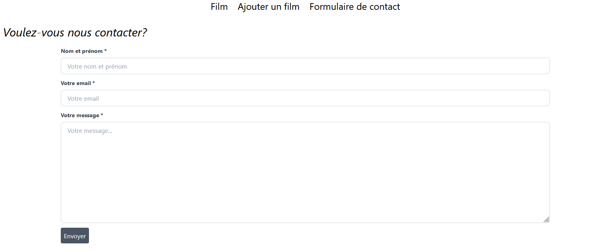

# Ajouter du style dans Django

Nous allons voir ici comment styliser notre application via du css ou avec le framework tailwind. 

Mais avant ça, on ne finaliserait pas nos formulaires du bonus 1? Il existe un filtre django permettant de styliser des formulaires via des composants de tailwind. 

## 1ère façon : Filtre `crispy-forms` et ajout de tailwind

Pour pouvoir l'utiliser, il faut au préalable l'installer dans votre projet ainsi que tailwind. 

```
pip install crispy-tailwind
pip install django-tailwind
```

**N'oubliez pas d'ajouter tailwind à votre base.html** 
`<script src="https://cdn.tailwindcss.com"></script>`

Deuxième étape, il vous suffit d'ajouter ceci au niveau du fichier des settings pour que le filtre crispy soit pris en compte :

````
INSTALLED_APPS = (
    ...
    "crispy_forms",
    "crispy_tailwind",
    ...
)

CRISPY_ALLOWED_TEMPLATE_PACKS = "tailwind"

CRISPY_TEMPLATE_PACK = "tailwind"
````

Et maintenant, il ne reste plus qu'à ajouter ce filtre dans un template contenant un formulaire, d'appliquer des classes tailwind et le style s'y appliquera. 

**N'oubliez pas de load les filtres en début de template!**


````html




<h1 class="text-3xl mb-5">Voulez-vous nous contacter?</h1>

    <div class="lg:w-full lg:max-w-7xl lg:mx-auto px-4">
        <form action="" method="post">
            
            {{ form|crispy }}
            <button class="bg-gray-600 p-2 rounded mb-5 hover:bg-gray-500 text-white">Envoyer</button>
        </form>
    </div>
    

````

Et voici le résultat : 



Déjà plus sympa non? 

## 2ème façon : Les éléments statiques 

Les éléments statiques correspondent en quelque sorte aux assets. C'est ici que l'on va retrouver les fichiers CSS/SASS, les fonts, les img, les scripts JS, ...

Il s'agit d'un dossier placé à la racine de votre projet et suivant la même logique que les templates où vous devez avoir autant de sous-dossiers que d'applications. 

````
_____
  |------app
  |       |--migrations
  |       |--admin.py
  |       |--apps.py
  |       |--models.py
  |       |--test.py
  |       |--views.py
  |
  |------django-app
  |          |
  |          |--urls.py
  |          |--settings.py
  |          |--asgi.py
  |          |--wsgi.py
  |
  |------static
  |          |--app
  |          |   |--css
  |          |   |--fonts
  |          |   |--js
  |          |   |--img
  |          |
  |          |--app(n)...
  |
  |------manage.py
````

Le principe est identique à du CSS classique. On attribue des classes aux tags et on met du style dans le fichier css. 

La seule subtilité au niveau de django, c'est le gabarit qui appelle des statics.

```html
<link rel="stylesheet" href="">
```

Il faut également ne pas oublier de load les statics 

````python

````

Si vous voulez utilisez du SASS, n'hésitez pas à aller voir ce [github](https://github.com/coderedcorp/django-sass).

Dans le cas de notre application, nous n'appliquerons pas d'éléments statiques, seules les classes tailwind sont utilisées. 

Bravo, vous pouvez dès à présent styliser vos pages, vos formulaires ainsi qu'ajouter du JavaScript ou des images à votre application. 


[Retour vers les bonus](https://github.com/CalcagnoLoic/workshop_python/blob/main/2.Framework_django/B0.bonus.md)