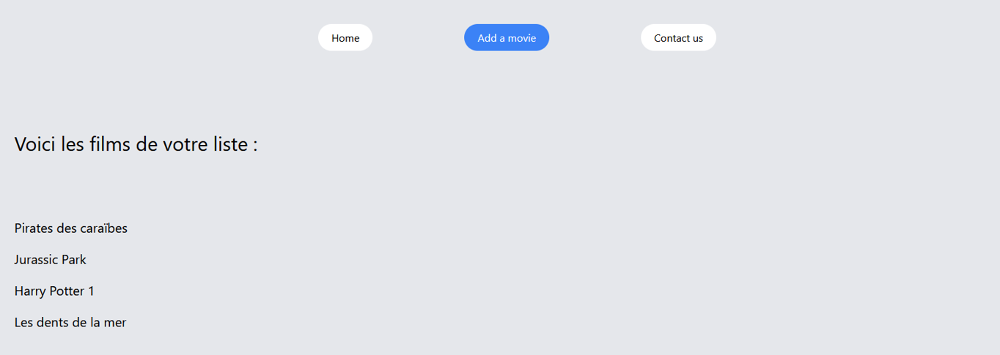
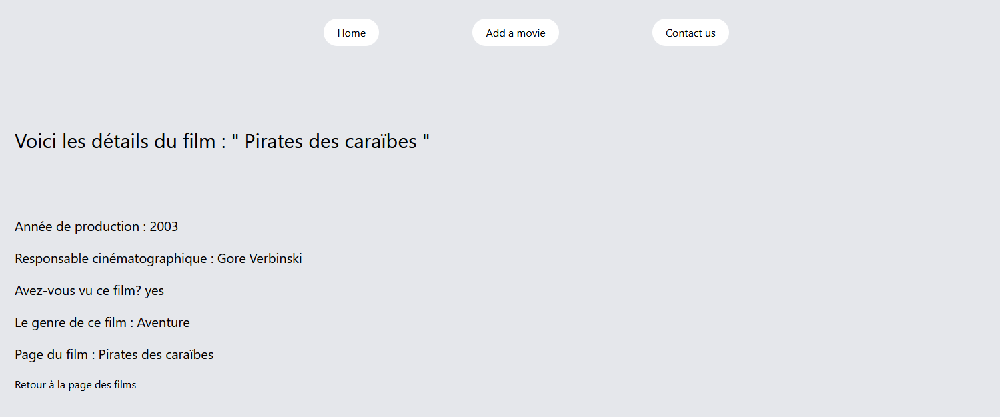
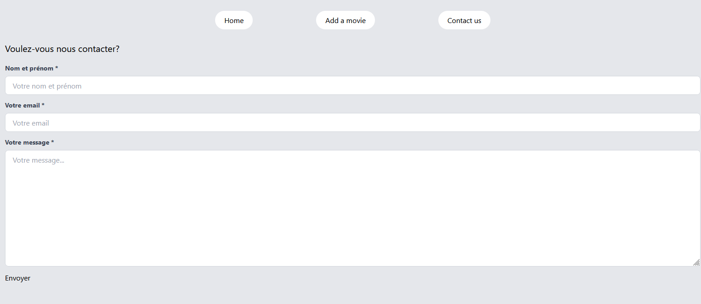

# Workshop python / Django

Vous retrouverez ici le projet design élaboré par notre gagnant [@Doriano](https://github.com/VVKDO98)

Ce projet design consistait en la refonte de notre site créé avec Django. 

Les différents participants avaient une durée d'1h00 pour designer le site à l'aide de tailwind et du filtre Crispy-Form. 

